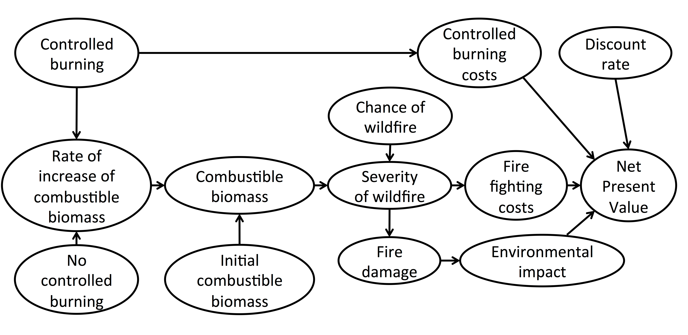

### Decision analysis with the decisionSupport package

#### The decisionSupport package

Decision-makers often wish to have a quantitative basis for their decisions.  However, there is often no ‘hard data’ for many important variables, which can paralyze decision-making processes or lead decision-makers to conclude that large research efforts are needed before a decision can be made. That is, many variables decision makers must consider cannot be precisely quantified, at least not without unreasonable effort. The major objective of (prescriptive) decision analysis is to support decision-making processes faced with this problem [@RN5]. Decision analysis can make forecasts of decision outcomes without precise numbers, as long as probability distributions describing the possible values for all variables can be estimated. 

The decisionSupport package [@RN3] implements this as a Monte Carlo simulation, which generates a large number of plausible system outcomes, based on random numbers for each input variable that are drawn from user-specified probability distributions. It also conducts a sensitivity analysis (based on Projection-to-Latent-Structures regression) to highlight uncertain variables that have large impacts on model outputs [@RN2; @RN1]. This approach is useful for determining whether a clearly preferable course of action can be delineated based on the present state of knowledge without the need for further information. If the distribution of predicted system outcomes doesn’t imply a clearly preferable decision option, variables identified as carrying decision-relevant uncertainty can then be targeted by decision-supporting research [@RN4]. This approach is explained in more detail below.

The ```decisionSupport()``` function in the R package ```decisionSupport``` can be applied to conduct decision analysis. The function requires two inputs:

1)	an R function that predicts decision outcomes based on the variables named in a separate data table. This R function is customized by the user to address a particular decision problem to provide the decision analysis model.  
2)	an input table (in .csv format) specifying the names and probability distributions for all variables used in the decision model. These distributions aim to represent the full range of possible values for each component of the model.  

These two inputs are provided as arguments to the ```decisionSupport()``` function, which conducts a Monte Carlo analysis with repeated model runs based on probability distributions for all uncertain variables. The data table and model are customized to fit the particulars of a specific decision.


#### Example – Controlled burning for ecological conservation in forests of the American West

The ecology of the conifer forests of the American west is largely shaped by wildfires. Many ecologists recommend regular and low-intensity burns to manage the build-up of combustible understory materials (shrubs, fallen branches). However, not all municipalities or regions implement these practices. Failure to follow the recommended controlled burning regime may lead to the build-up of fire stock and increase the severity of wildfires. Such wildfires have destroyed many conifer forest ecosystems of the Western United States in the recent past.

Here, we provide a simple example (in annotated R code) of how the decisionSupport package can be used to inform a decision process. The example provided simulates the decision of forest managers to use controlled fires in conifer forests vs. running the risk of severe fire. 

##### Input table
To support the model building process we design an input table ```wildfire_input_table.csv``` containing some of the basic values for the analysis. This table contains all the variables used in the model. Their distributions are described by a 90% confidence interval, which is specified by lower (5% quantile) and upper (95% quantile) bounds, as well as the shape of the distribution. This example uses four different distributions:

1.	```const``` – a constant value
1.	```norm``` – a normal distribution
1.	```tnorm_0_1``` – a truncated normal distribution that can only have values between 0 and 1 (useful for probabilities; note that 0 and 1, as well as numbers outside this interval are not permitted as inputs)
1.	```posnorm``` – a normal distribution truncated at 0 (only positive values allowed)

Here’s the input table for the wildfire example:

```{r}
setwd(getwd()) # this should be replaced by the folder where the wildfire_input_table.csv
#file it stored
format(read.csv("wildfire_input_table.csv")[,1:5],scientific=FALSE)
```

```{r include=FALSE}
library(decisionSupport)
make_variables<-function(est,n=1)
{ x<-random(rho=est, n=n)
    for(i in colnames(x)) assign(i,
     as.numeric(x[1,i]),envir=.GlobalEnv)
}

make_variables(estimate_read_csv("wildfire_input_table.csv"))
```

For a full list of possible distributions, type ```?random.estimate1d ``` in R. When specifying confidence intervals for truncated distributions, note that approximately 5% of the random values should ‘fit’ within the truncation interval on either side. If there isn’t enough space, the function will generate a warning (usually it will still work, but the inputs may not look like you intended them to).

Default distributions are provided for all variables, but feel free to make adjustments by editing the .csv file in a spreadsheet program.

#### Developing the model
To set up the analysis we first define a time line in the input table that contains information about whether there is a wildfire or a controlled burn in each year of our planning horizon. We specify this using the variable ```n_years``` (we use 20 years in this example).

We define a probability ```fire_risk``` (which can range from 0 to 1) that a wildfire will break out in a given year, and use the ```chance_event()``` function to simulate a time series of wildfire occurrence:

```{r}
Fire <- chance_event(fire_risk, value_if = 1, n = n_years)
```

This line of R code produces a series of ```n_years``` (here: 20) numbers (called a vector in R), which have a ```fire_risk``` chance of being 1 (specified by the value_if argument) and are 0 otherwise. The 1s indicate years that feature a wildfire, 0s mark years without a fire.

We also simulate whether controlled burns occur in a given year. If we assume that fire managers follow a strict schedule, this can be computed as

```{r}
Controlled <- as.numeric(1:n_years %% controlled_burning_frequency==0)
```

In the above code ```controlled_burning_frequency``` is from the input table, which is simply the number of years between two controlled burns (should be an integer). The symbol %% calls a modulo operation, which returns the remainder after dividing each of the year numbers (for ```1:n_years```) by ```controlled_burning_frequency```. If the year number is a multiple of the ```controlled_burning_frequency``` the code returns a ```TRUE``` evaluation. If the year is not a multiple, it returns a ```FALSE```. These values are then converted into 0s and 1s by using the ```as.numeric()``` function.

The code below combines these vectors into a data.frame called ```sim.fire``` that contains all information on our fire scenario.

```{r}
sim.fire <- data.frame(Year=1:n_years, Fire, Controlled)
sim.fire

```

We want to distinguish between mild and severe fires, because these differ strongly in the impact on the ecosystem and in the costs incurred in fighting the fire. To determine whether a fire is mild or severe, we simulate the amount of combustible biomass that has accumulated in a given year. When this biomass exceeds the threshold ```severity_threshold``` (from the input table) at the time of a wildfire outbreak, we classify the fire as severe, otherwise as mild.

To do this, we first have to simulate the amount of combustible biomass. We start by setting up two data.frames to store the results of this simulation, one for the no-burn scenario (```no.control```), and one for the scenario with controlled burns (```control```):

```{r}
no.control <- data.frame(Year = integer(), 
                         Biomass = double(), 
                         FireType = character(),
                         stringsAsFactors = F)

control <- data.frame(Year = integer(), 
                      Biomass = double(), 
                      FireType = character(),
                      stringsAsFactors = F)
```

Each of the two data.frames has three columns for the simulation year (```Year```), the combustible biomass (```Biomass```) and the fire type (```FireType```).
For year 1, we set the biomass for both scenarios to an initial level described by ```initial_biomass``` from the input table. We then start a loop that cycles through all years (with y used as a counter to describe which year we’re in) and computes that year’s biomass, according to the fire scenario that is encountered in each year.
We distinguish between four different fire settings (using the ```switch function```):
1)	When neither fire nor controlled burns occur, biomass increases by a certain percentage (```bio_accu_rate_no_contr_burn```).
2)	When a controlled burn occurs, biomass is reduced to ```biomass_after_burning```, but then increases by a certain percentage (```bio_accu_rate_contr_burn```).
3)	When a mild fire occurs, the biomass is reduced to ```biomass_after_mild_fire```.
4)	When a severe fire occurs, the biomass declines to ```biomass_after_severe_fire```.

All variables in steps 1-4 are from the input table.

We can then determine the fire severity by comparing the combustible biomass level with the fire severity. For this, we use several ```ifelse``` calls that first check if there was a controlled burn, then (if not) whether there was a fire, and finally whether biomass exceeded the threshold for a severe fire. Depending on the outcome of these tests, the FireType is set to “Controlled”, “None”, “Severe” or “Mild”.

This is simulated with the following code for the ```control``` scenario:

```{r}
  #start of year loop
  for (y in 1:n_years) {
    
    # record year
    control[y, "Year"] <- y
    
    # calculate biomass
    if (y == 1) {control[y, "Biomass"] <- initial_biomass} else {
      
      switch(EXPR = control[y - 1, "FireType"], 
             "Controlled" = {control[y, "Biomass"] <- biomass_after_burning * 
               (1 + bio_accu_rate_contr_burn/100)},
             "None" = {control[y, "Biomass"] <- control[y - 1, "Biomass"] * 
               (1 + bio_accu_rate_no_contr_burn/100)},
             "Severe" = {control[y, "Biomass"] <- biomass_after_severe_fire},
             "Mild" = {control[y, "Biomass"] <- biomass_after_mild_fire})}  
    
    # determine wild fire type
    ifelse(test = sim.fire[y,"Controlled"] == 1, 
           yes = control[y,"FireType"] <- "Controlled",
           no = ifelse(test = sim.fire[y,"Fire"] == 0,
                yes = control[y,"FireType"] <- "None",
                no = ifelse(test = sim.fire[y,"Fire"] == 1 && control[y,"Biomass"] > severity_threshold,
                     yes = control[y,"FireType"] <-  "Severe",
                     no = control[y,"FireType"] <-  "Mild")))
     
    
  } #end of year loop controlled burning scenario

```

For the ```no.control``` scenario, the code looks similar, except that there are no consequences of a Controlled fire, because such fires don't occur here:

```{r}
  #start of year loop
  for (y in 1:n_years) {
    
    # record year
    no.control[y, "Year"] <- y
    
    # calculate biomass
    if (y == 1) {no.control[y, "Biomass"] <- initial_biomass} else {
      
      switch(EXPR = no.control[y - 1, "FireType"], 
             "None" = {no.control[y, "Biomass"] <- no.control[y - 1, "Biomass"] * 
                     (1 + bio_accu_rate_no_contr_burn/100)},
             "Severe" = {no.control[y, "Biomass"] <- biomass_after_severe_fire},
             "Mild" = {no.control[y, "Biomass"] <- biomass_after_mild_fire})
      }  
      
    # determine fire type
    ifelse(test = sim.fire[y,"Fire"] == 0,
           yes = no.control[y,"FireType"] <- "None",
           no = ifelse(
             test = no.control[y,"Biomass"] > severity_threshold,
             yes = no.control[y,"FireType"] <-  "Severe",
             no =  no.control[y,"FireType"] <-  "Mild"))

  } #end of year loop 'no burn' scenario

```

At this point, the fire time series is complete, with all information stored in the data.frames ```control``` and ```no.control```:

```{r}
control
no.control
```

In the above simulation, the ```controlled_burning_frequency``` was `r controlled_burning_frequency` and the severity_threshold `r round(severity_threshold)`.

With this information we can move on to computing the cost implications for each scenario. We only consider three types of costs: the cost of controlled burning (```cost_of_controlled_burning```), the cost of fighting fires (```fire_fighting_cost```), and the value of the environmental damage caused by a fire (```env_imp```). We distinguish between severe and mild fires, so we get separate variables for the cost of firefighting (```fire_fighting_cost_mild_fire``` and ```fire_fighting_cost_severe_fire```) and the environmental impacts (```env_imp_mild_fire``` and ```env_imp_severe_fire```). For each year and each scenario, the applicable costs are selected (depending on the fire type) and added up to produce the total cost for each option. The result is then multiplied by the area under consideration (```area_size```) to produce the total cost.

```{r}

# calculate costs of no.control treatment -------------------------
  
  ff.cost.no.control <-
     (no.control$FireType == "Severe") * fire_fighting_cost_severe_fire +
     (no.control$FireType == "Mild") * fire_fighting_cost_mild_fire
  
  env.cost.no.control <-
     (no.control$FireType == "Severe") * env_imp_severe_fire + 
     (no.control$FireType == "Mild") * env_imp_mild_fire
  
  bottomline_no_burn <- - ( ff.cost.no.control + env.cost.no.control) * area_size
  
# calculate costs of control treatment
  
  treatment.cost.control <-
     (control$FireType == "Controlled") * cost_of_controlled_burning
  
  ff.cost.control <-
     (control$FireType == "Severe") * fire_fighting_cost_severe_fire +
     (control$FireType == "Mild") * fire_fighting_cost_mild_fire
  
  env.cost.control <-
     (control$FireType == "Severe") * env_imp_severe_fire + 
     (control$FireType == "Mild") * env_imp_mild_fire

  bottomline_contr_burn <-
      - (treatment.cost.control + ff.cost.control + env.cost.control) * area_size
 

```

Now we have two vectors that contain the annual costs of the two scenarios (```bottomline_contr_burn``` and ```bottomline_no_burn```). The net benefits of the controlled burning strategy (```benefit_of_controlled_burning```) are then simply calculated as the difference between control and no control:

```{r}
benefit_of_controlled_burning <- bottomline_contr_burn - bottomline_no_burn
```

This produces, for example:

```{r}
bottomline_no_burn
bottomline_contr_burn
benefit_of_controlled_burning
```

The last step in this decision model is to compute the total benefits by summing up the yearly values. A slight complication in this is that very few people are indifferent about the time at which they are faced with costs or benefits. Most people would prefer to have income now over having that same income in the future, and they feel the opposite way about expenses (most prefer expenses later). This characteristic is known as the time preference. We also say that people 'discount' future costs and benefits. This is considered when calculating the so-called Net Present Value (NPV), which discounts future costs or benefits by an investor-specific discount rate. Usually, the further in the future these costs and benefits occur, the lower their perceived value. ```decisionSupport``` provides a discounting function called ```discount()```, which implements the standard equation used by economists to compute the NPV. For example, a discount rate of 4% applied to a regular income stream of 100 dollars per year over 10 years would produce:

```{r}
discount(c(rep(100,10)),discount_rate = 4)
```

If we add the additional argument calculate_NPV=TRUE, to our code, the function automatically sums up these values to produce the Net Present Value:

```{r}
discount(c(rep(100,10)),discount_rate=4,calculate_NPV = TRUE)
```

We see that the perceived net benefit, the Net Present Value, is not 1000 dollars, as we would get by just adding up the yearly values, but only `r round(discount(c(rep(100,10)),discount_rate=4,calculate_NPV = TRUE))` dollars.

Applied to our example, and using the ```discount_rate variable``` (from the input table), this produces:

```{r}
NPV_controlled_burning <- discount(benefit_of_controlled_burning,
                                     discount_rate = discount_rate,
                                     calculate_NPV = TRUE)
```

With this metric, we can compare the two forest management options.

Here’s an illustration of the basic steps of the simulation:

{width=500px}

We now show how this overview can be translated into a probabilistic simulation using the ```decisionSupport``` package. We’ve already developed much of the code we’ll need, but we have to put it in the right frame, and we have to develop an input table, where we can specify our uncertainty about all the input variables.

##### The decision model input

The decision model is coded as an R function which takes in the variables provided in the data table and generates a model output, such as the Net Present Value. 

Before you start developing the decision model (an R function), open R and download and load the ```decisionSupport``` package (version >1.102).

```
install.packages("decisionSupport")
library(decisionSupport)
```

You could simply start developing the decision model now, but since the model function will be designed to make use of variables provided to it externally (random numbers drawn according to the information in the data table), you’ll need to define sample values for all variables, if you want to test pieces of the function code during the development process. This can be done manually, but it's more easily accomplished with the following helper function ```make_variables```:

```
make_variables<-function(est,n=1)
{ x<-random(rho=est, n=n)
    for(i in colnames(x)) assign(i,
     as.numeric(x[1,i]),envir=.GlobalEnv)
}
```
(This function isn’t included in the ```decisionSupport``` package, because it places the desired variables in the global environment. This isn’t allowed for functions included in packages on R’s download servers.)

Applying ```make_variables``` to the data table (with default setting ```n=1```) generates one random number for each variable, which then allows you to easily test code you’re developing:

```
setwd([folder, where the ‘wildfire_input_table.csv’ file is saved])
make_variables(estimate_read_csv("wildfire_input_table.csv"))
```


You can now start developing the decision model, which has to be designed as a function for R, without any arguments, as well as a (named or unnamed) list of numbers as output:

```
[YOUR_MODEL]<-function()
{
[freely programmable content, relying only on inputs specified in the data table]
return(list([OUTPUTS]))
}
```
Below is an R function (decision model) for the wildfire decision, which calculates the Net Present Value (NPV) for the decision to manage forests with controlled burns. The decision model function name in this example is ```burn.sim```. This function takes has no arguments, but when run through the ```decisionSupport()``` function, it receives values for all the variables specified in the input file. The function will return a single output value, which is a list containing the NPV. You’ll see that this function is largely compiled of the code we developed above:

```{r}
burn.sim <- function(){

  # set up dataframe to store simulation fire conditions
  Fire <- chance_event(fire_risk, value_if = 1,n = n_years) 
  Controlled <-  as.numeric(1:n_years %% controlled_burning_frequency==0)
  sim.fire <- data.frame(1:n_years, Fire, Controlled)
  
# --- 'no controlled burn' scenario ----------------------------
  
  # set up dataframe to store results
  no.control <- data.frame(Year = integer(), 
                           Biomass = double(), 
                           FireType = character(),
                           stringsAsFactors = F)
  #start of year loop
  for (y in 1:n_years) {
    
    # record year
    no.control[y, "Year"] <- y
    
    # calculate biomass
    if (y == 1) {no.control[y, "Biomass"] <- initial_biomass} else {
      
      switch(EXPR = no.control[y - 1, "FireType"], 
             "None" = {no.control[y, "Biomass"] <- no.control[y - 1, "Biomass"] * 
                     (1 + bio_accu_rate_no_contr_burn/100)},
             "Severe" = {no.control[y, "Biomass"] <- biomass_after_severe_fire},
             "Mild" = {no.control[y, "Biomass"] <- biomass_after_mild_fire})
      }  
      
    # determine fire type
    ifelse(test = sim.fire[y,"Fire"] == 0,
           yes = no.control[y,"FireType"] <- "None",
           no = ifelse(
             test = no.control[y,"Biomass"] > severity_threshold,
             yes = no.control[y,"FireType"] <-  "Severe",
             no =  no.control[y,"FireType"] <-  "Mild"))

  } #end of year loop 'no burn' scenario
    
# ---  controlled burning scenario ---------------------------
  
  # set up dataframe to store results
  control <- data.frame(Year = integer(), 
             Biomass = double(), 
             FireType = character(),
             stringsAsFactors = F)
  
  #start of year loop
  for (y in 1:n_years) {
    
    # record year
    control[y, "Year"] <- y
    
    # calculate biomass
    if (y == 1) {control[y, "Biomass"] <- initial_biomass} else {
      
      switch(EXPR = control[y - 1, "FireType"], 
             "Controlled" = {control[y, "Biomass"] <- biomass_after_burning * 
               (1 + bio_accu_rate_contr_burn/100)},
             "None" = {control[y, "Biomass"] <- control[y - 1, "Biomass"] * 
               (1 + bio_accu_rate_no_contr_burn/100)},
             "Severe" = {control[y, "Biomass"] <- biomass_after_severe_fire},
             "Mild" = {control[y, "Biomass"] <- biomass_after_mild_fire})}  
    
    # determine wild fire type
    ifelse(test = sim.fire[y,"Controlled"] == 1, 
           yes = control[y,"FireType"] <- "Controlled",
           no = ifelse(test = sim.fire[y,"Fire"] == 0,
                yes = control[y,"FireType"] <- "None",
                no = ifelse(test = sim.fire[y,"Fire"] == 1 && control[y,"Biomass"] > severity_threshold,
                     yes = control[y,"FireType"] <-  "Severe",
                     no = control[y,"FireType"] <-  "Mild")))
     
    
  } #end of year loop controlled burning scenario
  
# calculate costs of no.control treatment -------------------------
  
  ff.cost.no.control <- (no.control$FireType == "Severe") * fire_fighting_cost_severe_fire +
                        (no.control$FireType == "Mild") * fire_fighting_cost_mild_fire
  
  env.cost.no.control <- (no.control$FireType == "Severe") * env_imp_severe_fire + 
                         (no.control$FireType == "Mild") * env_imp_mild_fire
  
  bottomline_no_burn <- - ( ff.cost.no.control + env.cost.no.control) * area_size
  
# calculate costs of control treatment
  
  treatment.cost.control <- (control$FireType == "Controlled") * cost_of_controlled_burning
  
  ff.cost.control <- (control$FireType == "Severe") * fire_fighting_cost_severe_fire +
                     (control$FireType == "Mild") * fire_fighting_cost_mild_fire
  
  env.cost.control <- (control$FireType == "Severe") * env_imp_severe_fire + 
                      (control$FireType == "Mild") * env_imp_mild_fire
 
  bottomline_contr_burn <- - (treatment.cost.control + ff.cost.control + env.cost.control) * area_size
  
# return key results
  
  # calculate the benefit of controlled burning over no controlled burning
  benefit_of_controlled_burning <- (bottomline_contr_burn - bottomline_no_burn)
  
  #calculate the Net Present Value (NPV) for forest management with controlled burning
  NPV_controlled_burning <- discount(benefit_of_controlled_burning,
                                     discount_rate = discount_rate,
                                     calculate_NPV = TRUE)
  
  return(list(NPV_controlled_burning = NPV_controlled_burning))

} # end of function

```

As described above, this model uses two ‘helper functions’ included in the ```decisionSupport``` package:
1.	```chance_event``` for determining whether an event occurs or not based on a specified probability
1.	```discount``` for adjusting net benefits for time preference (a standard economic practice). With the attribute ```calculate_NPV```, the function automatically calculates the Net Present Value (the sum of discounted values)

### Running the analysis with the ```decisionSupport()``` function

The model function, along with the data table input, are fed into the Monte Carlo simulation function, ```decisionSupport()``` to conduct the full decision analysis.
Below is the code to perform the Monte Carlo simulation with 10,000 model runs:

```
setwd([folder, where the ‘wildfire_input_table.csv’ file is saved])
decisionSupport(inputFilePath = "wildfire_input_table.csv", #input file with estimates
                outputPath = file.path(getwd(),"MCResults"), #output folder
                write_table = TRUE,
                welfareFunction = burn.sim,
                numberOfModelRuns = 1000,
                functionSyntax = "plainNames")
```
The ```decisionSupport()``` arguments are:

1.	```inputFilePath``` – the data table that contains the inputs to the decision model. This is a .csv file containing columns for the variable names (```variable```), the distribution type (```distribution```) and the lower (```lower```) and upper (```upper```) bounds of the 90% confidence interval to be used for defining the probability distributions, from which values for the model runs will be drawn.
1.	```outputPath``` – the folder that will store all results.
1.	```write_table``` – Boolean variable (```FALSE``` or ```TRUE```) indicating whether the full table with all inputs and outputs for all model runs should be saved to disk. If ```TRUE```, this information is stored in a file called ```mcSimulationResults.csv```.
1.	```welfareFunction``` – the decision model function, in this case ```burn.sim```.
1.	```numberOfModelRuns``` – integer indicating the number of model runs for the Monte Carlo simulation. Unless the model function is very complex, 10,000 runs is a reasonable choice (for complex models, 10,000 model runs can take a while, so especially when the model is still under development, it often makes sense to use a lower number).
1.	```functionSyntax``` – technical parameter indicating how the random numbers are passed to the decision model. In this example, we used the ```plainNames``` option, which allows us to call all input variables simply by the names we provided in the input table. Other options are ```data.frameNames```  (where variables are called with an ```x[[“variable_name”]]``` or ```x$variable_name``` notation) or ```matrixNames``` (where calls are ```x[,”variable_name”]```). Among these three choices, ```plainNames``` is the slowest but most user-friendly option.

The ```decisionSupport()``` function produces a table of all inputs and outputs of all model runs (```mcSimulationResults.csv```; only if ```write_table=TRUE```), as well as two outputs for each model output variable:

1.	a histogram showing all output values
1.	a variable-importance-plot that illustrates the sensitivity of model outputs to variation in each input variable (this is derived by statistically relating outputs to inputs using Projection-to-Latent-Structures (PLS) regression; results are also saved in a table).

All results are stored in the folder specified by ```outputPath```. The two summary tables ```mcSummary.csv``` and ```welfareDecisionSummary.csv``` provide summaries of the results shown in the histogram.

Here’s the automatically generated histogram figure, based on 10,000 model runs:

{width=500px}

```{r include=FALSE}
mcSummary<-read.csv("MCResults/mcSummary.csv")
```

This diagram shows the number of times that the model produced values in a certain interval (bin). The green bars show the interval between the 45th and 55th percentile, i.e. the distribution’s median ± 5% of output values. The orange area (plus the green bars) is the interquartile range, i.e. the range between the 25th and 75th percentile. Yellow bars (plus orange and green ones) show the 90% confidence interval, i.e. the range between the 5th and 95th percentiles. In this example, the figure indicates that controlled burning probably generates a net benefit over the ‘no burn’ scenario, with 90% confidence of the net benefit being between `r mcSummary$X5.` and `r mcSummary$X95.` USD.

Some descriptive statistics for this figure are contained in the ```mcSummary.csv``` file, which can be accessed by typing ```read.csv(‘MCResults/mcSummary.csv’)```. This table has information on various percentiles, as well as the mean and chances of negative and positive values, as well as the chance that the outcome is zero:

```{r}
read.csv("MCResults/mcSummary.csv")
```
The second figure is the VIP plot, i.e. a diagram showing the Variable Importance in the Projection, a metric to evaluate the significance of individual variables in a Projection-to-Latent-Structures (PLS) regression model:

{width=500px}

This figure indicates, which input variables had the strongest influence on the model outputs. If also contains a vertical line at VIP=0.8, which is commonly used as a threshold for considering variables as important for explaining variation in the response variable [@RN1]. In this plot, bars shown in green indicate that there is a positive relationship between values of the input variable and values of the output variable, while red bars imply a negative relationship. Variables that were not found to be important (according to the VIP=0.8 threshold) are shown in gray.

In our case, 4 variables showed up as important. High values for the firefighting costs for severe fires, the environmental impact of severe fires and the biomass accumulation rate without controlled burning were associated with high net benefits of implementing controlled burns (green bars). The higher the cost of controlled burns, the lower the net benefit of this option (red bar). The most influential variable in this model was the cost of fighting severe fires. Additional clarity on the expected net benefits of controlled burns could be gained by collecting information on these important variables.

Finally, the ‘welfareDecisionSummary.csv’ table contains information pertaining to the decision problem that was analyzed here:

```{r}
read.csv("MCResults/welfareDecisionSummary.csv")
```

Besides the median and 90% confidence interval of the output distribution, this table also contains information on the optimal choice (either PA for project approval, or SQ for maintaining the status quo). Further outputs here are:

* enbPa: The expected Net Benefit of project approval: ENB(PA)
This is the expected value of the Monte Carlo output distribution (sum of all values multiplied by their chance of occurrence).

* elPa: Expected Loss in case of project approval: EL(PA)
Based on all model runs, where the PA decision (approve the project) produces negative results, the sum of all output values multiplied by their chance of occurrence.

* elSq: Expected Loss in case of status quo: EL(SQ)
Based on all model runs, where the SQ decision (maintain the status quo) produces negative results, the sum of all output values multiplied by their chance of occurrence.

* eol: Expected Opportunity Loss: EOL
This is the smaller of EL(PA) and EL(SQ) – the opportunity loss associated with the recommended choice.

More information on all this is contained in the ```decisionSupport``` manual, especially under ```welfareDecisionAnalysis```.

Taken together, all these outputs allow an evaluation of the plausible range of net benefits that can be expected to arise from the decision. They provide a recommendation on which decision option should be preferred, and an appraisal of which input variables are responsible for most of the variation in the output distribution.

In this example, and with the set of input values provided with it, controlled burns emerge as the preferable management strategy, compared to a scenario without controlled burns.

#### Concluding remarks

This example was constructed for conformity with a spreadsheet model, which means that some computations aren’t optimized for calculation speed. For example, setting up data.frames for storing all results is relatively time-consuming, compared to just storing them as vectors. Loops are also a relatively inefficient way to implement simulations (though they are often hard to avoid), and we’ve lost additional time by selecting the user-friendly but slow plainNames option for passing the function syntax to decisionSupport. Speed considerations aren’t very important, when we only run a process once, but since in the Monte Carlo simulation all delays are multiplied by ```numberOfModelRuns``` (e.g. 10,000), they can sometimes add up to substantial time losses. Even with highly efficient coding, Monte Carlo simulations can sometimes take a while for complex decision analyses.

But good things are sometimes worth waiting for, and we hope that we were able to demonstrate that adding a probabilistic element to a simulation adds substantial value to an analysis. Mostly, it avoids making spurious assumptions, replacing uncertainty with ‘best bets’ and producing results that do not reflect the knowledge limitations that make decision-making so challenging. The objective of the ```decisionSupport``` package is to make it easier for analysts to produce decision-relevant information that adequately reflects the imperfect nature of the information we usually have. We tried our best to demonstrate its usefulness and hope that we’ve managed to encourage you to apply it to your own modeling projects in the future.

#### Acknowledgment

Thanks to Therese Donovan at the University of Vermont, who provided inputs into the model, set up the parallel spreadsheet model to help demonstrate the way the package works, and inspired us to put this example together in the first place. Thanks also to Lutz Göhring, who programmed most of ```decisionSupport```, and to the World Agroforestry Centre, which supported its development.

#### References
